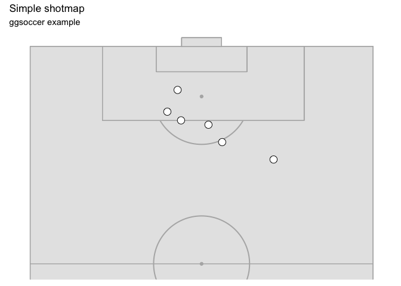

<!-- README.md is generated from README.Rmd. Please edit that file -->
ggsoccer
========

Overview
--------

ggsoccer provides a handful of functions to make plotting Opta-style soccer event data in R/ggplot2.

Installation
------------

ggsoccer is not currently available on CRAN and must be downloaded from github like so:

``` r
# install.packages("devtools")
devtools::install_github("torvaney/ggsoccer")
```

Usage
-----

The following example uses ggsoccer to solve a fairly realistic problem: plot a set of shots onto a soccer pitch.

``` r
library(ggplot2)
library(ggsoccer)

shots <- data.frame(x = c(90, 85, 82, 78, 83),
                    y = c(43, 40, 52, 56, 44))

ggplot(shots, aes(x = x, y = y)) +
  annotate_pitch() +
  geom_point(size = 3) +
  theme_pitch() +
  direction_label() +
  xlim(-1, 101) +
  ylim(-5, 101) +
  ggtitle("Simple shotmap",
          "ggsoccer example")
```



You may want to customise your pitch plot. Here is a different example, plotting passes on a green pitch:

``` r
pass_data <- data.frame(x = c(24, 18, 64, 78, 53),
                        y = c(43, 55, 88, 18, 44),
                        x2 = c(34, 44, 81, 82, 64),
                        y2 = c(40, 59, 89, 44, 28))

ggplot(pass_data) +
  annotate_pitch(colour = "forestgreen",
                 fill = "lightgreen") +
  geom_segment(aes(x = x, y = y, xend = x2, yend = y2),
               arrow = arrow(length = unit(0.25, "cm"),
                             type = "closed")) +
  theme_pitch() +
  direction_label() +
  xlim(-1, 101) +
  ylim(-5, 101) +
  ggtitle("Simple passmap", 
          "ggsoccer example")
```


